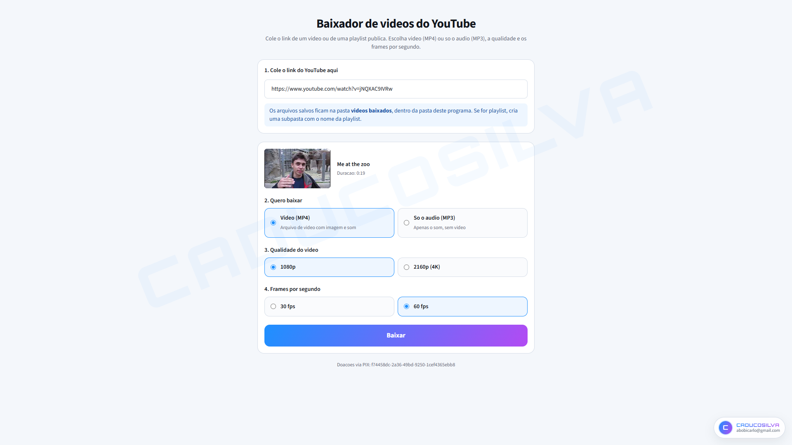
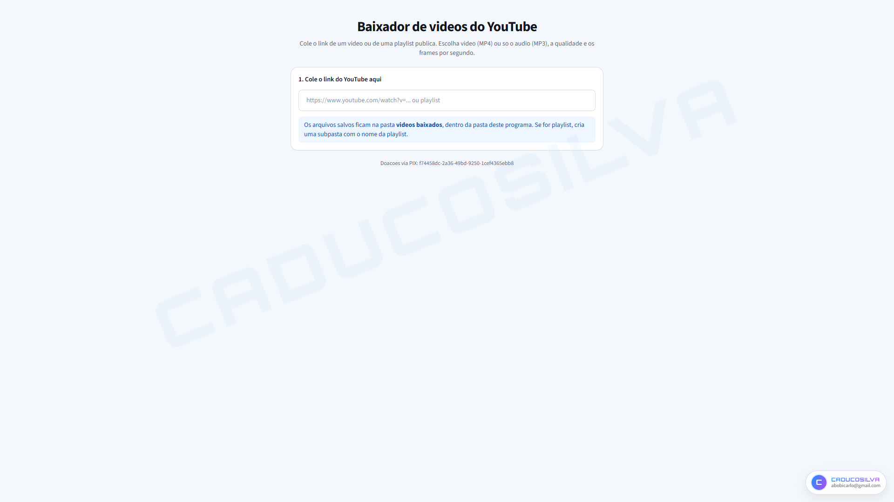
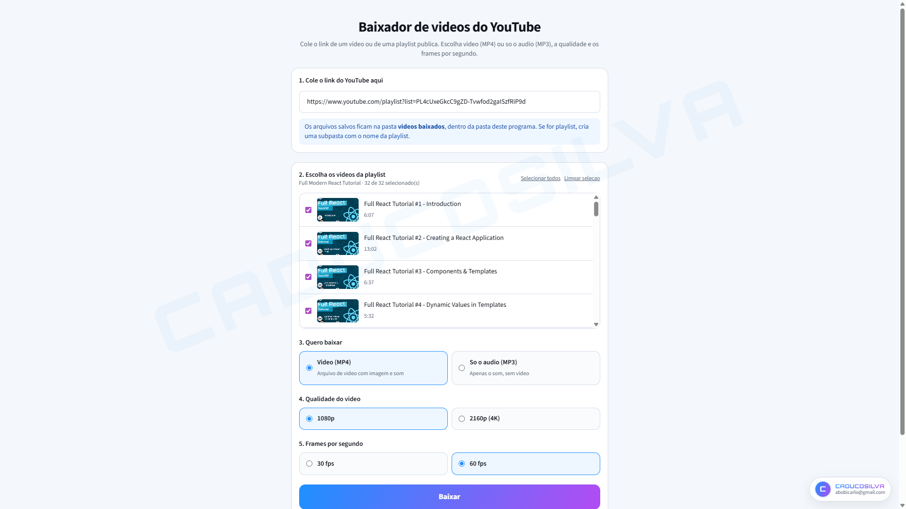
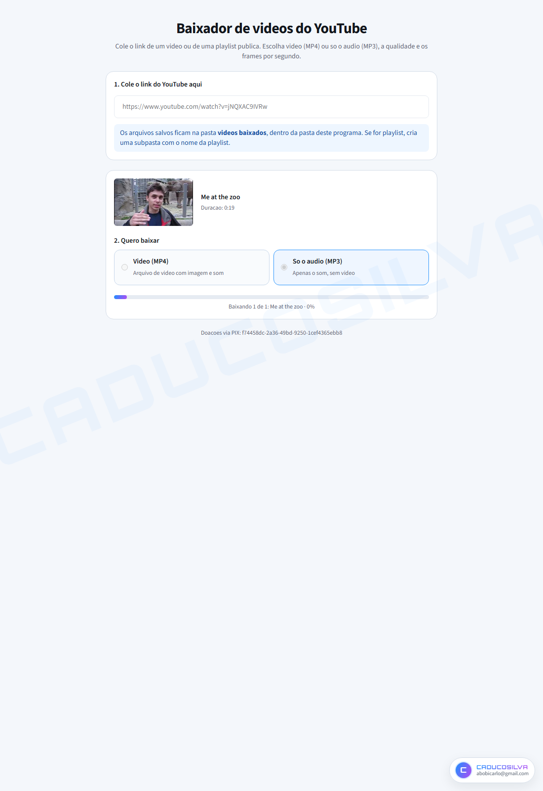
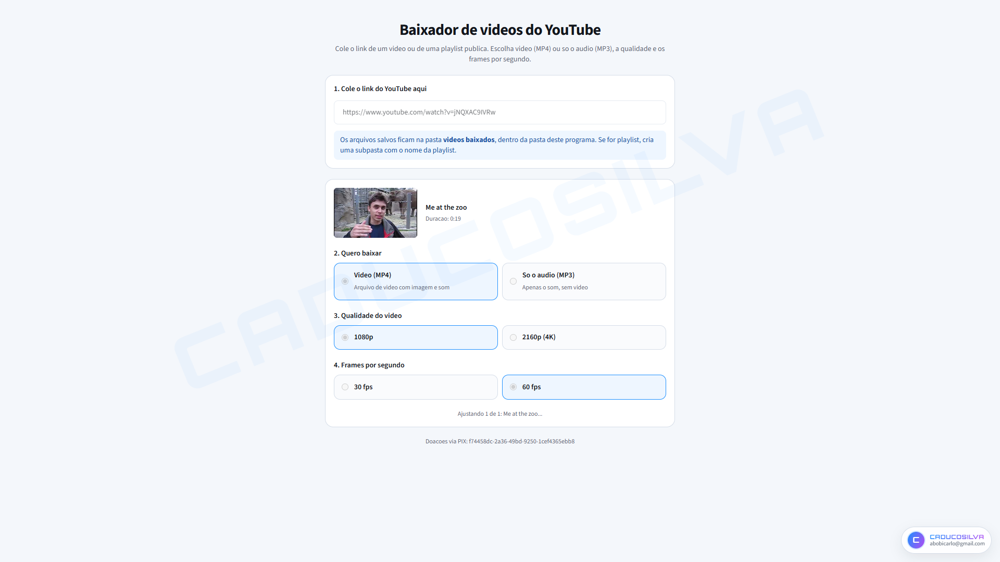
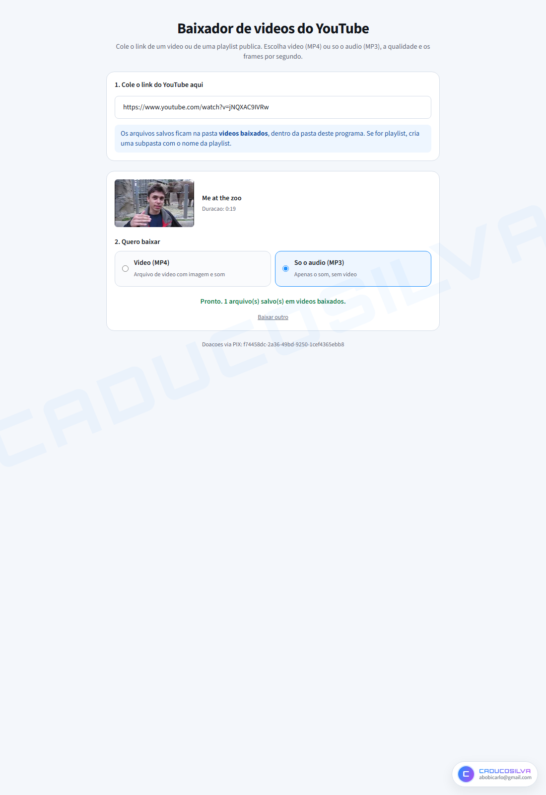

# Baixador de videos do YouTube

[](./LICENSE)
[](https://nextjs.org/)
[](https://www.typescriptlang.org/)

Aplicativo **local** com interface web para baixar videos e audios do YouTube.
Feito com Next.js, React e TypeScript.

Cole o link, escolha o formato e baixe. Sem terminal no dia a dia.

<p align="center">
  
</p>

## Recursos

- Video (MP4) ou so o audio (MP3)
- Qualidade 1080p ou 2160p (4K)
- 30 fps ou 60 fps
- Video avulso e playlist publica
- Na playlist: selecionar todos ou so alguns
- Arquivos em `videos baixados` (subpasta automatica para playlists)
- Padrao: MP4 em 1080p e 60 fps

No modo video, o resultado e forçado para a resolucao escolhida
(1920x1080 ou 3840x2160), mantendo a proporcao e completando com faixas
pretas se precisar. O FPS tambem e ajustado para 30 ou 60.

## Capturas de tela

| Inicio | Playlist | Download |
| --- | --- | --- |
|  |  |  |

| Convertendo | Pronto |
| --- | --- |
|  |  |

## Como usar

1. Rode o app na sua maquina (ele abre sozinho no Google Chrome).
2. Cole o link de um video ou de uma playlist publica.
3. Se for playlist, marque os videos desejados.
4. Escolha MP4 ou MP3, qualidade e FPS (quando for video).
5. Clique em **Baixar**.
6. Os arquivos ficam em `videos baixados`, dentro da pasta do programa.

## Pre requisitos

- [Node.js](https://nodejs.org/) 20 ou mais recente
- [yt-dlp](https://github.com/yt-dlp/yt-dlp) no PATH
- [FFmpeg](https://ffmpeg.org/) no PATH (inclui `ffprobe`)
- [Deno](https://deno.com/) no PATH (usado pelo yt-dlp)
- Google Chrome
- Git (so na primeira execucao, para preparar o servidor de PO token)

## Instalacao

```bash
npm install
```

## Como rodar

```bash
npm run app
```

Na primeira vez o app prepara o servidor de PO token, builda a interface,
sobe tudo localmente e abre o Chrome. No Windows tambem da para clicar duas
vezes em `start.bat`.

Desenvolvimento com recarregamento automatico:

```bash
npm run dev
```

## Configuracao opcional (anti-bloqueio)

O YouTube as vezes pede para confirmar que quem esta baixando nao e um
robo. O app sobe sozinho, na primeira execucao, uma copia local do
[bgutil-ytdlp-pot-provider](https://github.com/Brainicism/bgutil-ytdlp-pot-provider).

Se ainda assim houver bloqueio, copie `.env.example` para `.env.local` e
preencha `FIREFOX_PROFILE_PATH` com um perfil do Firefox que ja visitou
o youtube.com.

**Nao versione `.env.local`.** Esse arquivo fica so na sua maquina.

## Estrutura

```
app/
  page.tsx                interface
  api/metadata/route.ts   confere video ou playlist
  api/download/route.ts   download com progresso (SSE)
lib/
  ytdlp.ts                yt-dlp, ffmpeg e ffprobe
  paths.ts                pastas de saida
scripts/
  setup-pot-server.mjs    prepara o PO token
  launch.mjs              sobe tudo e abre o Chrome
docs/screenshots/         capturas da interface
```

## Uso responsavel

Baixe apenas conteudo que voce tem direito de baixar (proprio, licenca
aberta ou uso permitido). Respeite os direitos autorais de terceiros.

## Licenca

Distribuido sob a licenca **MIT**. Veja o arquivo [LICENSE](./LICENSE).

## Autor

**CADUCOSILVA** · Carlos Eduardo ([@caducosilva](https://github.com/caducosilva))

Contato: abobicarlo@gmail.com

### Doacoes via PIX

Chave aleatoria:

```
f74458dc-2a36-49bd-9250-1cef4365ebb8
```

<p align="center">
  
</p>

<p align="center"><em>Escaneie com o app do seu banco</em></p>

## Contato

Autor: Carlos Eduardo

- LinkedIn: https://www.linkedin.com/in/carlos-da-silva20ba5740a
- Instagram: https://www.instagram.com/caducosilva
- GitHub: https://github.com/caducosilva
